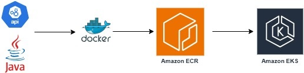
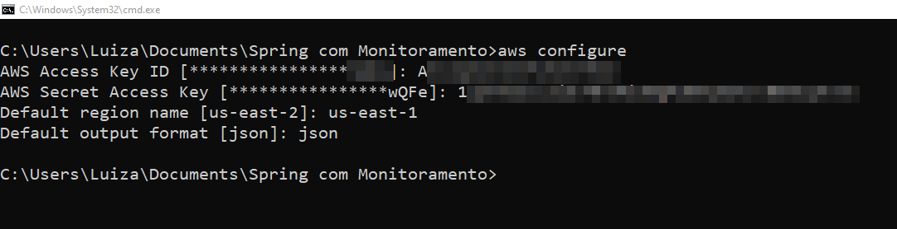
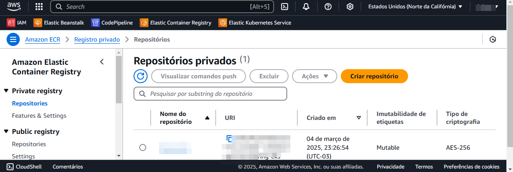
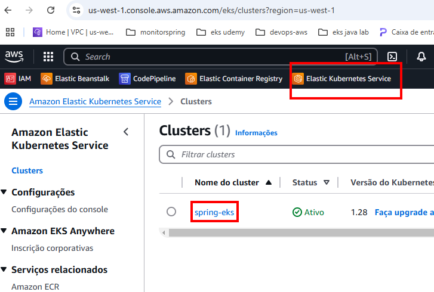

  
# Deploy Spring on EKS

## 🔗 Links  

[](https://br.linkedin.com/in/luiza-andrade-ti/) [](https://github.com/luizaandradeti/) 

[](https://skillicons.dev)

## Tech Stack  
**Client:** Postman, AWS account, eksctl, Docker
**Backend softwares:** Java 17, IntelliJ

- https://eksctl.io/installation/
# Table of contents  
1. [Create a spring project](#create-spring)  
2. [Create Docker Image](#create-docker-image)  
3. [Push image to ECR](#ECR)  
3. [Deploy ECR into EKS](#EKS)  

  


## Start🚀  
To get started... Follow the steps in the flow
  
## 1.Create Spring
**Dependences:** Lombok, Spring web

- Generate an executable JAR 

``` mvn clean install```

## Create Docker in Git Bash
**Choose region in AWS Console:**

  

**Create a Repositoy into AWS ECR PANEL**


 

**Deploy the image into ECR**


**Login and push the api image on ECR:**

   ````
aws ecr get-login-password --region us-east-1 | docker login --username AWS --password-stdin 05075xxxxxxxx.dkr.ecr.us-east-1.amazonaws.com

docker build -t spring-eks .
    
docker tag spring-eks:latest 05075xxxxxxxx.dkr.ecr.us-east-1.amazonaws.com/spring-eks:latest

docker push 05075xxxxxxxx.dkr.ecr.us-east-1.amazonaws.com/spring-eks:latest
   
````
**Configure eksctl to use the EKS Cluster(replace region and name):**

**Create cluster:**


```
    eksctl create cluster --name spring-eks --version 1.28 --nodes=1 --node-type=t2.small --region us-east-1
```
 
```
    aws eks --region us-east-1 update-kubeconfig --name spring-eks1
```
output:
```
    Added new context arn: (...)
```
**Finally type apply to create:**
```
    kubectl apply -f kubernets/deploykube.yaml
```
Output contain link to access application 


````kubectl get svc
NAME          TYPE           CLUSTER-IP      EXTERNAL-IP                                                               PORT(S)        AGE
app-service   LoadBalancer   10.100.228.59
   zxxxxxx0434db28fb9041533d6f39-2075808567.us-east-1.elb.amazonaws.com   80:31268/TCP   112s
````
